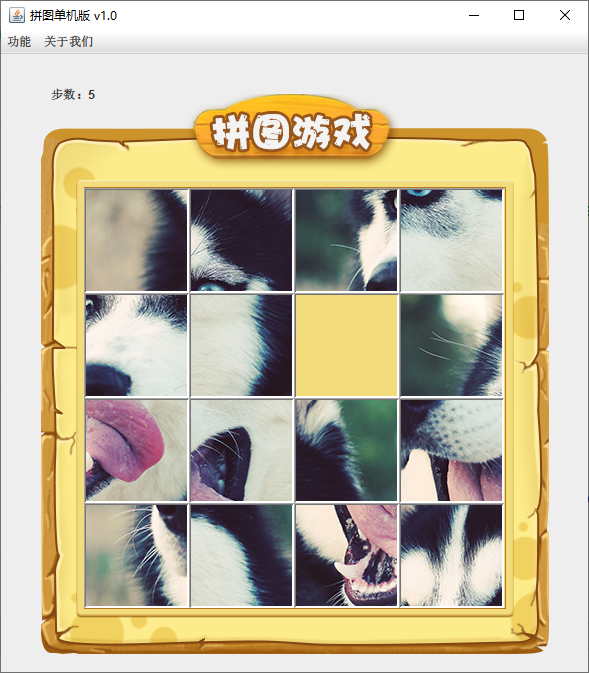
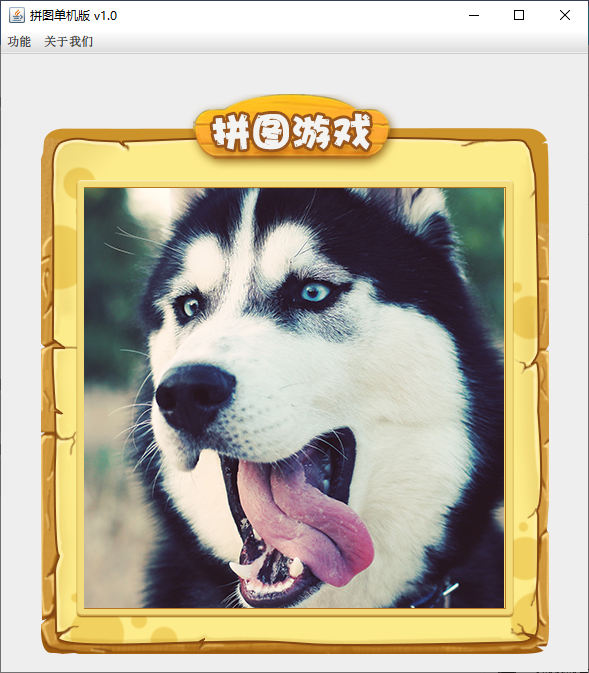

## 1. 美化界面

界面搭建好之后，就需要美化界面了，本次需要美化下面四个地方：

1. 将15张小图片移动到界面的中央偏下方 
2. 添加背景图片

3. 添加图片的边框 
4. 优化路径

### 1.1 小图片居中

原本的小图片，都在左上角的位置，不好看，我想让他们居中，这样就需要给每一张图片在x和y都进行一个偏移即可。

代码示例：

```java
for (int i = 0; i < 4; i++) {
    //内循环 --- 表示在一行添加4张图片
    for (int j = 0; j < 4; j++) {
        //获取当前要加载图片的序号
        int num = data[i][j];
        //创建一个JLabel的对象（管理容器）
        JLabel jLabel = new JLabel(new ImageIcon(path + num + ".jpg"));
        //指定图片位置，并进行适当的偏移
        jLabel.setBounds(105 * j + 83, 105 * i + 134, 105, 105);
        //给图片添加边框
        //0:表示让图片凸起来
        //1：表示让图片凹下去
        jLabel.setBorder(new BevelBorder(BevelBorder.LOWERED));
        //把管理容器添加到界面中
        this.getContentPane().add(jLabel);
    }
}
```

###  1.2 添加背景图片

​	细节：代码中后添加的，塞在下方

代码示例：

```java
for (int i = 0; i < 4; i++) {
    //内循环 --- 表示在一行添加4张图片
    for (int j = 0; j < 4; j++) {
        //获取当前要加载图片的序号
        int num = data[i][j];
        //创建一个JLabel的对象（管理容器）
        JLabel jLabel = new JLabel(new ImageIcon("F:\\JavaSE最新版\\day17-面向对象综合练习（下）\\代码\\" + num + ".jpg"));
        //指定图片位置
        jLabel.setBounds(105 * j + 83, 105 * i + 134, 105, 105);
        //给图片添加边框
        //0:表示让图片凸起来
        //1：表示让图片凹下去
        jLabel.setBorder(new BevelBorder(BevelBorder.LOWERED));
        //把管理容器添加到界面中
        this.getContentPane().add(jLabel);
    }
}


//添加背景图片
JLabel background = new JLabel(new ImageIcon("F:\JavaSE最新版\day17-面向对象综合练习（下）\代码\puzzlegame\\image\\background.png"));
background.setBounds(40, 40, 508, 560);
//把背景图片添加到界面当中
this.getContentPane().add(background);
```

### 1.3 添加图片的边框

```java
//给图片添加边框
//括号中也可以写0或者1
//要注意，这个凸凹跟大家自己理解的可能会有偏差
//0:表示让图片凸起来，图片凸起来，边框就会凹下去
//1：表示让图片凹下去，图片凹下去，边框就会凸起来
//但是0和1不好记，所以Java中就定义了常亮表示，方便记忆
//BevelBorder.LOWERED：表示1
//BevelBorder.RAISED：表示0
jLabel.setBorder(new BevelBorder(BevelBorder.LOWERED));
```

### 1.4 优化路径

之前我们写的路径是完整路径：

```java
F:\JavaSE最新版\day17-面向对象综合练习（下）\代码\puzzlegame\image\animal\animal3\1.jpg
```

这样会有两个坏处：

一：路径太长，代码阅读不方便

二：项目拿到别人电脑上时，如果别人电脑上没有F盘和对应的文件夹，就找不到图片

#### 1.4.1 计算机中的两种路径

* 绝对路径

  从判断开始的路径，此时路径是固定的。

```java
C:\\a.txt
```

* 相对路径

  没有从判断开始的路径

```java
aaa\\bbb\\a.txt
```

目前为止，在idea中，相对路径是相对当前项目而言的。

以下面的路径为例：

```java
aaa\\bbb\\a.txt
```

在寻找的时候，先找当前项目，在当前项目下找aaa，在aaa里面找bbb，在bbb里面找a.txt

利用这个原理，我们可以修改项目中路径的书写：

代码示例：

```java
//添加背景图片
JLabel background = new JLabel(new ImageIcon("puzzlegame\\image\\background.png"));
background.setBounds(40, 40, 508, 560);
//把背景图片添加到界面当中
this.getContentPane().add(background);
```


## 2. 上下左右移动的逻辑




#### 业务分析：

上下左右的我们看上去就是移动空白的方块，实则逻辑跟我们看上去的相反：

* 上移：是把空白区域下方的图片上移。
* 下移：是把空白区域上方的图片下移。
* 左移：是把空白区域右方的图片左移。
* 右移：是把空白区域左方的图片右移。

但是在移动的时候也有一些小问题要注意：

* 如果空白区域已经在最上面了，此时x=0，那么就无法再下移了。
* 如果空白区域已经在最下面了，此时x=3，那么就无法再上移了。
* 如果空白区域已经在最左侧了，此时y=1，那么就无法再右移了。
* 如果空白区域已经在最右侧了，此时y=3，那么就无法再左移了。

#### 实现步骤：

1. 本类实现KeyListener接口，并重写所有抽象方法
2. 给整个界面添加键盘监听事件
3. 统计一下空白方块对应的数字0在二维数组中的位置
4. 在keyReleased方法当中实现移动的逻辑

#### 代码实现：

```java
//松开按键的时候会调用这个方法
@Override
public void keyReleased(KeyEvent e) {
    //对上，下，左，右进行判断
    //左：37 上：38 右：39 下：40
    int code = e.getKeyCode();
    if (code == 37) {
        System.out.println("向左移动");
        //逻辑：
        //把空白方块右方的数字往左移动
        data[x][y] = data[x][y + 1];
        data[x][y + 1] = 0;
        y++;
        //调用方法按照最新的数字加载图片
        initImage();
    } else if (code == 38) {
        System.out.println("向上移动");
        //逻辑：
        //把空白方块下方的数字往上移动
        //x，y  表示空白方块
        //x + 1， y 表示空白方块下方的数字
        //把空白方块下方的数字赋值给空白方块
        data[x][y] = data[x + 1][y];
        data[x + 1][y] = 0;
        x++;
        //调用方法按照最新的数字加载图片
        initImage();
    } else if (code == 39) {
        System.out.println("向右移动");
        //逻辑：
        //把空白方块左方的数字往右移动
        data[x][y] = data[x][y - 1];
        data[x][y - 1] = 0;
        y--;
        //每移动一次，计数器就自增一次。
        initImage();
    } else if (code == 40) {
        System.out.println("向下移动");
        //逻辑：
        //把空白方块上方的数字往下移动
        data[x][y] = data[x - 1][y];
        data[x - 1][y] = 0;
        x--;
        //调用方法按照最新的数字加载图片
        initImage();
    }
}
```

## 3. 查看完整图片的功能

 

#### 业务分析：

​	在玩游戏的过程中，我想看一下最终的效果图，该怎么办呢？

此时可以添加一个功能，当我们长按某个键（假设为A）,不松的时候，就显示完整图片，松开就显示原来的图片

#### 实现步骤：

1. 给整个界面添加键盘事件
2. 在keyPressed中书写按下不松的逻辑
3. 在keyReleased中书写松开的逻辑

#### 代码实现：

```java
//按下不松时会调用这个方法
@Override
public void keyPressed(KeyEvent e) {
    int code = e.getKeyCode();
    if (code == 65){
        //把界面中所有的图片全部删除
        this.getContentPane().removeAll();
        //加载第一张完整的图片
        JLabel all = new JLabel(new ImageIcon(path + "all.jpg"));
        all.setBounds(83,134,420,420);
        this.getContentPane().add(all);
        //加载背景图片
        //添加背景图片
        JLabel background = new JLabel(new ImageIcon("puzzlegame\\image\\background.png"));
        background.setBounds(40, 40, 508, 560);
        //把背景图片添加到界面当中
        this.getContentPane().add(background);
        //刷新界面
        this.getContentPane().repaint();


    }
}


//松开按键的时候会调用这个方法
    @Override
    public void keyReleased(KeyEvent e) {
        ...
        else if(code == 65){
            initImage();
        }
        ....
    }
```


## 4. 作弊码

#### 业务分许：

​	不想玩了，想要一键通关

#### 实现步骤：

1. 给整个界面添加键盘事件
2. 在keyReleased中书写松开的逻辑，当按下W的时候一键通关。

备注：当然各位小伙伴可以改写这段逻辑，当按下W的时候，可以将数据排列成还需要走这么两三步才能一键通关的，这样你在跟好基友PK的时候，操作是不是更加隐秘呢？

#### 代码实现：

```java
//松开按键的时候会调用这个方法
@Override
public void keyReleased(KeyEvent e) {
    ...
        else if(code == 87){
            data = new int[][]{
                {1,2,3,4},
                {5,6,7,8},
                {9,10,11,12},
                {13,14,15,0}
            };
            initImage();
        }
    ....
}
```

## 5. 判断胜利

#### 业务分许：

​	当游戏的图标排列正确了，需要有胜利图标显示。

​	每次上下左右移动图片的时候都需要进行判断。

​	在keyReleased中方法一开始的地方就需要写判断是否胜利

#### 实现步骤：

1. 定义一个正确的二维数组win。
2. 在加载图片之前，先判断一下二维数组中的数字跟win数组中是否相同。
3. 如果相同展示正确图标
4. 如果不同则不展示正确图标

#### 代码实现：

   ```java
public class GameJFrame extends JFrame implements KeyListener,ActionListener{
    ...
        //定义一个二维数组，存储正确的数据
        int[][] win = {
        {1,2,3,4},
        {5,6,7,8},
        {9,10,11,12},
        {13,14,15,0}
    };

    private void initImage() {
        //清空原本已经出现的所有图片
        this.getContentPane().removeAll();

        if (victory()) {
            //显示胜利的图标
            JLabel winJLabel = new JLabel(new ImageIcon("C:\\Users\\moon\\IdeaProjects\\basic-code\\puzzlegame\\image\\win.png"));
            winJLabel.setBounds(203,283,197,73);
            this.getContentPane().add(winJLabel);
        }   
        
        ...
            
    }   

    //判断data数组中的数据是否跟win数组中相同
    //如果全部相同，返回true。否则返回false
    public boolean victory(){
        for (int i = 0; i < data.length; i++) {
            //i : 依次表示二维数组 data里面的索引
            //data[i]：依次表示每一个一维数组
            for (int j = 0; j < data[i].length; j++) {
                if(data[i][j] != win[i][j]){
                    //只要有一个数据不一样，则返回false
                    return false;
                }
            }
        }
        //循环结束表示数组遍历比较完毕，全都一样返回true
        return true;
    }
}
   ```

## 6. 计步功能


#### 业务分许：

​	左上角的计步器，每移动一次，计步器就需要自增一次

#### 实现步骤：

1. 定义一个变量用来统计已经玩了多少步。
2. 每次按上下左右的时候计步器自增一次即可。

#### 代码实现：

```java
public class GameJFrame extends JFrame implements KeyListener,ActionListener{
    ...
    //定义变量用来统计步数
    int step = 0;
    
    //初始化图片
    //添加图片的时候，就需要按照二维数组中管理的数据添加图片
    private void initImage() {

        //清空原本已经出现的所有图片
        this.getContentPane().removeAll();

        if (victory()) {
            //显示胜利的图标
            JLabel winJLabel = new JLabel(new ImageIcon("C:\\Users\\moon\\IdeaProjects\\basic-code\\puzzlegame\\image\\win.png"));
            winJLabel.setBounds(203,283,197,73);
            this.getContentPane().add(winJLabel);
        }


        JLabel stepCount = new JLabel("步数：" + step);
        stepCount.setBounds(50,30,100,20);
        this.getContentPane().add(stepCount);


        //路径分为两种：
        //绝对路径：一定是从盘符开始的。C:\  D：\
        //相对路径：不是从盘符开始的
        //相对路径相对当前项目而言的。 aaa\\bbb
        //在当前项目下，去找aaa文件夹，里面再找bbb文件夹。

        //细节：
        //先加载的图片在上方，后加载的图片塞在下面。
        //外循环 --- 把内循环重复执行了4次。
        for (int i = 0; i < 4; i++) {
            //内循环 --- 表示在一行添加4张图片
            for (int j = 0; j < 4; j++) {
                //获取当前要加载图片的序号
                int num = data[i][j];
                //创建一个JLabel的对象（管理容器）
                JLabel jLabel = new JLabel(new ImageIcon(path + num + ".jpg"));
                //指定图片位置
                jLabel.setBounds(105 * j + 83, 105 * i + 134, 105, 105);
                //给图片添加边框
                //0:表示让图片凸起来
                //1：表示让图片凹下去
                jLabel.setBorder(new BevelBorder(BevelBorder.LOWERED));
                //把管理容器添加到界面中
                this.getContentPane().add(jLabel);
            }
        }


        //添加背景图片
        JLabel background = new JLabel(new ImageIcon("puzzlegame\\image\\background.png"));
        background.setBounds(40, 40, 508, 560);
        //把背景图片添加到界面当中
        this.getContentPane().add(background);


        //刷新一下界面
        this.getContentPane().repaint();


    }

   //松开按键的时候会调用这个方法
    @Override
    public void keyReleased(KeyEvent e) {
        //判断游戏是否胜利，如果胜利，此方法需要直接结束，不能再执行下面的移动代码了
        if(victory()){
            //结束方法
            return;
        }
        //对上，下，左，右进行判断
        //左：37 上：38 右：39 下：40
        int code = e.getKeyCode();
        System.out.println(code);
        if (code == 37) {
            System.out.println("向左移动");
            if(y == 3){
                return;
            }
            //逻辑：
            //把空白方块右方的数字往左移动
            data[x][y] = data[x][y + 1];
            data[x][y + 1] = 0;
            y++;
            //每移动一次，计数器就自增一次。
            step++;
            //调用方法按照最新的数字加载图片
            initImage();

        } else if (code == 38) {
            System.out.println("向上移动");
            if(x == 3){
                //表示空白方块已经在最下方了，他的下面没有图片再能移动了
                return;
            }
            //逻辑：
            //把空白方块下方的数字往上移动
            //x，y  表示空白方块
            //x + 1， y 表示空白方块下方的数字
            //把空白方块下方的数字赋值给空白方块
            data[x][y] = data[x + 1][y];
            data[x + 1][y] = 0;
            x++;
            //每移动一次，计数器就自增一次。
            step++;
            //调用方法按照最新的数字加载图片
            initImage();
        } else if (code == 39) {
            System.out.println("向右移动");
            if(y == 0){
                return;
            }
            //逻辑：
            //把空白方块左方的数字往右移动
            data[x][y] = data[x][y - 1];
            data[x][y - 1] = 0;
            y--;
            //每移动一次，计数器就自增一次。
            step++;
            //调用方法按照最新的数字加载图片
            initImage();
        } else if (code == 40) {
            System.out.println("向下移动");
            if(x == 0){
                return;
            }
            //逻辑：
            //把空白方块上方的数字往下移动
            data[x][y] = data[x - 1][y];
            data[x - 1][y] = 0;
            x--;
            //每移动一次，计数器就自增一次。
            step++;
            //调用方法按照最新的数字加载图片
            initImage();
        }else if(code == 65){
            initImage();
        }else if(code == 87){
            data = new int[][]{
                    {1,2,3,4},
                    {5,6,7,8},
                    {9,10,11,12},
                    {13,14,15,0}
            };
            initImage();
        }
    }
    
    ...
}
```

## 7. 其他功能

#### 业务分许：

​	完成重新开始、关闭游戏、关于我们。这三个都是在菜单上的，所以可以一起完成

重新开始：点击之后，重新打乱图片，计步器清零

关闭游戏：点击之后，全部关闭

关于我们：点击之后出现黑马程序员的公众号二维码

#### 实现步骤：

1. 给菜单上的每个选项添加点击事件
2. 在actionPerformed方法中实现对应的逻辑即可

#### 代码实现：


代码实现：

```java
@Override
public void actionPerformed(ActionEvent e) {
    //获取当前被点击的条目对象
    Object obj = e.getSource();
    //判断
    if(obj == replayItem){
        System.out.println("重新游戏");
        //计步器清零
        step = 0;
        //再次打乱二维数组中的数据
        initData();
        //重新加载图片
        initImage();
    }else if(obj == reLoginItem){
        System.out.println("重新登录");
        //关闭当前的游戏界面
        this.setVisible(false);
        //打开登录界面
        new LoginJFrame();
    }else if(obj == closeItem){
        System.out.println("关闭游戏");
        //直接关闭虚拟机即可
        System.exit(0);
    }else if(obj == accountItem){
        System.out.println("公众号");

        //创建一个弹框对象
        JDialog jDialog = new JDialog();
        //创建一个管理图片的容器对象JLabel
        JLabel jLabel = new JLabel(new ImageIcon("puzzlegame\\image\\about.png"));
        //设置位置和宽高
        jLabel.setBounds(0,0,258,258);
        //把图片添加到弹框当中
        jDialog.getContentPane().add(jLabel);
        //给弹框设置大小
        jDialog.setSize(344,344);
        //让弹框置顶
        jDialog.setAlwaysOnTop(true);
        //让弹框居中
        jDialog.setLocationRelativeTo(null);
        //弹框不关闭则无法操作下面的界面
        jDialog.setModal(true);
        //让弹框显示出来
        jDialog.setVisible(true);
    }
}
```

## 8.游戏完整代码

```java
public class GameJFrame extends JFrame implements KeyListener,ActionListener{
    //JFrame 界面，窗体
    //子类呢？也表示界面，窗体
    //规定：GameJFrame这个界面表示的就是游戏的主界面
    //以后跟游戏相关的所有逻辑都写在这个类中

    //创建一个二维数组
    //目的：用来管理数据
    //加载图片的时候，会根据二维数组中的数据进行加载
    int[][] data = new int[4][4];

    //记录空白方块在二维数组中的位置
    int x = 0;
    int y = 0;

    //定义一个变量，记录当前展示图片的路径
    String path = "puzzlegame\\image\\animal\\animal3\\";


    //定义一个二维数组，存储正确的数据
    int[][] win = {
        {1,2,3,4},
        {5,6,7,8},
        {9,10,11,12},
        {13,14,15,0}
    };

    //定义变量用来统计步数
    int step = 0;


    //创建选项下面的条目对象
    JMenuItem replayItem = new JMenuItem("重新游戏");
    JMenuItem reLoginItem = new JMenuItem("重新登录");
    JMenuItem closeItem = new JMenuItem("关闭游戏");

    JMenuItem accountItem = new JMenuItem("公众号");


    public GameJFrame() {
        //初始化界面
        initJFrame();

        //初始化菜单
        initJMenuBar();


        //初始化数据（打乱）
        initData();

        //初始化图片（根据打乱之后的结果去加载图片）
        initImage();

        //让界面显示出来，建议写在最后
        this.setVisible(true);

    }


    //初始化数据（打乱）
    private void initData() {
        //1.定义一个一维数组
        int[] tempArr = {0, 1, 2, 3, 4, 5, 6, 7, 8, 9, 10, 11, 12, 13, 14, 15};
        //2.打乱数组中的数据的顺序
        //遍历数组，得到每一个元素，拿着每一个元素跟随机索引上的数据进行交换
        Random r = new Random();
        for (int i = 0; i < tempArr.length; i++) {
            //获取到随机索引
            int index = r.nextInt(tempArr.length);
            //拿着遍历到的每一个数据，跟随机索引上的数据进行交换
            int temp = tempArr[i];
            tempArr[i] = tempArr[index];
            tempArr[index] = temp;
        }

        /*
        *
        *           5   6   8   9
        *           10  11  15  1
        *           4   7   12  13
        *           2   3   0  14
        *
        *           5   6   8   9   10  11  15  1   4   7   12  13  2   3   0   14
        * */

        //4.给二维数组添加数据
        //遍历一维数组tempArr得到每一个元素，把每一个元素依次添加到二维数组当中
        for (int i = 0; i < tempArr.length; i++) {
            if (tempArr[i] == 0) {
                x = i / 4;
                y = i % 4;
            }
            data[i / 4][i % 4] = tempArr[i];
        }
    }

    //初始化图片
    //添加图片的时候，就需要按照二维数组中管理的数据添加图片
    private void initImage() {

        //清空原本已经出现的所有图片
        this.getContentPane().removeAll();

        if (victory()) {
            //显示胜利的图标
            JLabel winJLabel = new JLabel(new ImageIcon("C:\\Users\\moon\\IdeaProjects\\basic-code\\puzzlegame\\image\\win.png"));
            winJLabel.setBounds(203,283,197,73);
            this.getContentPane().add(winJLabel);
        }


        JLabel stepCount = new JLabel("步数：" + step);
        stepCount.setBounds(50,30,100,20);
        this.getContentPane().add(stepCount);


        //路径分为两种：
        //绝对路径：一定是从盘符开始的。C:\  D：\
        //相对路径：不是从盘符开始的
        //相对路径相对当前项目而言的。 aaa\\bbb
        //在当前项目下，去找aaa文件夹，里面再找bbb文件夹。

        //细节：
        //先加载的图片在上方，后加载的图片塞在下面。
        //外循环 --- 把内循环重复执行了4次。
        for (int i = 0; i < 4; i++) {
            //内循环 --- 表示在一行添加4张图片
            for (int j = 0; j < 4; j++) {
                //获取当前要加载图片的序号
                int num = data[i][j];
                //创建一个JLabel的对象（管理容器）
                JLabel jLabel = new JLabel(new ImageIcon(path + num + ".jpg"));
                //指定图片位置
                jLabel.setBounds(105 * j + 83, 105 * i + 134, 105, 105);
                //给图片添加边框
                //0:表示让图片凸起来
                //1：表示让图片凹下去
                jLabel.setBorder(new BevelBorder(BevelBorder.LOWERED));
                //把管理容器添加到界面中
                this.getContentPane().add(jLabel);
            }
        }


        //添加背景图片
        JLabel background = new JLabel(new ImageIcon("puzzlegame\\image\\background.png"));
        background.setBounds(40, 40, 508, 560);
        //把背景图片添加到界面当中
        this.getContentPane().add(background);


        //刷新一下界面
        this.getContentPane().repaint();


    }

    private void initJMenuBar() {
        //创建整个的菜单对象
        JMenuBar jMenuBar = new JMenuBar();
        //创建菜单上面的两个选项的对象 （功能  关于我们）
        JMenu functionJMenu = new JMenu("功能");
        JMenu aboutJMenu = new JMenu("关于我们");


        //将每一个选项下面的条目添加到选项当中
        functionJMenu.add(replayItem);
        functionJMenu.add(reLoginItem);
        functionJMenu.add(closeItem);

        aboutJMenu.add(accountItem);

        //给条目绑定事件
        replayItem.addActionListener(this);
        reLoginItem.addActionListener(this);
        closeItem.addActionListener(this);
        accountItem.addActionListener(this);

        //将菜单里面的两个选项添加到菜单当中
        jMenuBar.add(functionJMenu);
        jMenuBar.add(aboutJMenu);


        //给整个界面设置菜单
        this.setJMenuBar(jMenuBar);
    }

    private void initJFrame() {
        //设置界面的宽高
        this.setSize(603, 680);
        //设置界面的标题
        this.setTitle("拼图单机版 v1.0");
        //设置界面置顶
        this.setAlwaysOnTop(true);
        //设置界面居中
        this.setLocationRelativeTo(null);
        //设置关闭模式
        this.setDefaultCloseOperation(WindowConstants.EXIT_ON_CLOSE);
        //取消默认的居中放置，只有取消了才会按照XY轴的形式添加组件
        this.setLayout(null);
        //给整个界面添加键盘监听事件
        this.addKeyListener(this);

    }

    @Override
    public void keyTyped(KeyEvent e) {

    }

    //按下不松时会调用这个方法
    @Override
    public void keyPressed(KeyEvent e) {
        int code = e.getKeyCode();
        if (code == 65){
            //把界面中所有的图片全部删除
            this.getContentPane().removeAll();
            //加载第一张完整的图片
            JLabel all = new JLabel(new ImageIcon(path + "all.jpg"));
            all.setBounds(83,134,420,420);
            this.getContentPane().add(all);
            //加载背景图片
            //添加背景图片
            JLabel background = new JLabel(new ImageIcon("puzzlegame\\image\\background.png"));
            background.setBounds(40, 40, 508, 560);
            //把背景图片添加到界面当中
            this.getContentPane().add(background);
            //刷新界面
            this.getContentPane().repaint();


        }
    }

    //松开按键的时候会调用这个方法
    @Override
    public void keyReleased(KeyEvent e) {
        //判断游戏是否胜利，如果胜利，此方法需要直接结束，不能再执行下面的移动代码了
        if(victory()){
            //结束方法
            return;
        }
        //对上，下，左，右进行判断
        //左：37 上：38 右：39 下：40
        int code = e.getKeyCode();
        System.out.println(code);
        if (code == 37) {
            System.out.println("向左移动");
            if(y == 3){
                return;
            }
            //逻辑：
            //把空白方块右方的数字往左移动
            data[x][y] = data[x][y + 1];
            data[x][y + 1] = 0;
            y++;
            //每移动一次，计数器就自增一次。
            step++;
            //调用方法按照最新的数字加载图片
            initImage();

        } else if (code == 38) {
            System.out.println("向上移动");
            if(x == 3){
                //表示空白方块已经在最下方了，他的下面没有图片再能移动了
                return;
            }
            //逻辑：
            //把空白方块下方的数字往上移动
            //x，y  表示空白方块
            //x + 1， y 表示空白方块下方的数字
            //把空白方块下方的数字赋值给空白方块
            data[x][y] = data[x + 1][y];
            data[x + 1][y] = 0;
            x++;
            //每移动一次，计数器就自增一次。
            step++;
            //调用方法按照最新的数字加载图片
            initImage();
        } else if (code == 39) {
            System.out.println("向右移动");
            if(y == 0){
                return;
            }
            //逻辑：
            //把空白方块左方的数字往右移动
            data[x][y] = data[x][y - 1];
            data[x][y - 1] = 0;
            y--;
            //每移动一次，计数器就自增一次。
            step++;
            //调用方法按照最新的数字加载图片
            initImage();
        } else if (code == 40) {
            System.out.println("向下移动");
            if(x == 0){
                return;
            }
            //逻辑：
            //把空白方块上方的数字往下移动
            data[x][y] = data[x - 1][y];
            data[x - 1][y] = 0;
            x--;
            //每移动一次，计数器就自增一次。
            step++;
            //调用方法按照最新的数字加载图片
            initImage();
        }else if(code == 65){
            initImage();
        }else if(code == 87){
            data = new int[][]{
                {1,2,3,4},
                {5,6,7,8},
                {9,10,11,12},
                {13,14,15,0}
            };
            initImage();
        }
    }


    //判断data数组中的数据是否跟win数组中相同
    //如果全部相同，返回true。否则返回false
    public boolean victory(){
        for (int i = 0; i < data.length; i++) {
            //i : 依次表示二维数组 data里面的索引
            //data[i]：依次表示每一个一维数组
            for (int j = 0; j < data[i].length; j++) {
                if(data[i][j] != win[i][j]){
                    //只要有一个数据不一样，则返回false
                    return false;
                }
            }
        }
        //循环结束表示数组遍历比较完毕，全都一样返回true
        return true;
    }

    @Override
    public void actionPerformed(ActionEvent e) {
        //获取当前被点击的条目对象
        Object obj = e.getSource();
        //判断
        if(obj == replayItem){
            System.out.println("重新游戏");
            //计步器清零
            step = 0;
            //再次打乱二维数组中的数据
            initData();
            //重新加载图片
            initImage();
        }else if(obj == reLoginItem){
            System.out.println("重新登录");
            //关闭当前的游戏界面
            this.setVisible(false);
            //打开登录界面
            new LoginJFrame();
        }else if(obj == closeItem){
            System.out.println("关闭游戏");
            //直接关闭虚拟机即可
            System.exit(0);
        }else if(obj == accountItem){
            System.out.println("公众号");

            //创建一个弹框对象
            JDialog jDialog = new JDialog();
            //创建一个管理图片的容器对象JLabel
            JLabel jLabel = new JLabel(new ImageIcon("puzzlegame\\image\\about.png"));
            //设置位置和宽高
            jLabel.setBounds(0,0,258,258);
            //把图片添加到弹框当中
            jDialog.getContentPane().add(jLabel);
            //给弹框设置大小
            jDialog.setSize(344,344);
            //让弹框置顶
            jDialog.setAlwaysOnTop(true);
            //让弹框居中
            jDialog.setLocationRelativeTo(null);
            //弹框不关闭则无法操作下面的界面
            jDialog.setModal(true);
            //让弹框显示出来
            jDialog.setVisible(true);
        }
    }
}
```


​	


